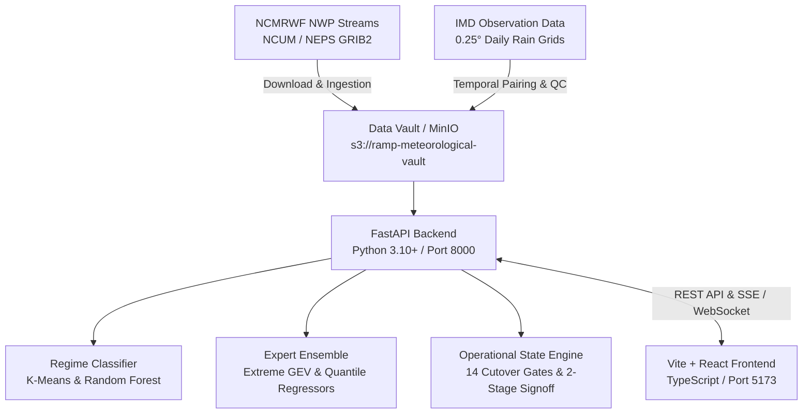

# RAMP — Operational Execution & Run Guide
**SIH26080 | Regime-Aware Mixture-of-Experts AI Post-Processor for Monsoon Rainfall Forecasts**  
**Ministry of Earth Sciences (MoES) / National Centre for Medium Range Weather Forecasting (NCMRWF)**

---

## 1. System Overview & Architecture

RAMP is an enterprise-grade meteorological AI post-processing platform designed to correct spatial and quantitative precipitation forecast biases in numerical weather prediction models (NCMRWF NCUM 12 km and NEPS 12 km ensembles) against IMD high-resolution gridded observations.



### Component Breakdown
- **Backend API**: FastAPI application served via Uvicorn on `http://localhost:8000`. Exposes 22 modular routers (`/api/operational`, `/api/production`, `/api/acceptance`, `/api/real-data`, etc.).
- **Frontend Dashboard**: React 18, TypeScript, TailwindCSS, Lucide-React, and MapLibre GL served via Vite on `http://localhost:5173`.
- **Object Storage**: S3-compatible MinIO server (`http://localhost:9000`) for meteorological binary payloads (NetCDF4, GRIB2, `.grd`), with **automated local disk fallback** (`data/real/vault/objects/`).
- **Database & Catalog**: SQLite3 (default zero-config fallback) or PostgreSQL with Supabase for data object metadata and experiment tracking.

---

## 2. Prerequisites

| Software | Minimum Version | Recommended | Notes |
| :--- | :--- | :--- | :--- |
| **Python** | `3.10+` | `3.11` / `3.12` / `3.14` | Ensure Python is added to `PATH` |
| **Node.js** | `18.x+` | `20.x LTS` | Includes `npm` |
| **Docker** | `20.x+` | Latest Docker Desktop | Optional (for MinIO container) |

---

## 3. Fast Start (Step-by-Step)

### Step 1: Environment Configuration
Ensure `.env` exists in the repository root. A production-ready template is already configured:

```ini
# Core URLs
VITE_API_URL=http://localhost:8000
VITE_API_BASE_URL=http://localhost:8000

# Backend Settings
APP_NAME=RAMP-MoES-NCMRWF
APP_ENV=development
APP_HOST=0.0.0.0
APP_PORT=8000
DEBUG=true

# Data Mode: SYNTHETIC_DEMO | REAL_DATA_EXPERIMENT | REAL_OPERATIONAL
RAMP_DATA_MODE=REAL_OPERATIONAL

# Object Storage (MinIO or LOCAL_FALLBACK)
STORAGE_MODE=MINIO
MINIO_ENDPOINT=http://localhost:9000
MINIO_ACCESS_KEY=admin
MINIO_SECRET_KEY=admin12345
MINIO_BUCKET=ramp-meteorological-vault

# Project Data Root
RAMP_DATA_ROOT=D:/SIH26080/data
```

---

### Step 2: Start the Backend (Terminal 1)

In PowerShell or command prompt from the repository root (`d:\SIH26080`):

```powershell
# Navigate to project root
cd d:\SIH26080

# Launch Uvicorn server
python -m uvicorn ramp.main:app --host 0.0.0.0 --port 8000 --reload
```

> **Verification**:
> - Open `http://localhost:8000/api/health` in your browser. You should see:
>   ```json
>   {"status":"healthy","version":"0.1.0","environment":"development","data_mode":"REAL_OPERATIONAL"}
>   ```
> - Interactive Swagger API Docs: `http://localhost:8000/docs`

---

### Step 3: Start the Frontend (Terminal 2)

In a new terminal window:

```powershell
# Navigate to frontend directory
cd d:\SIH26080\frontend

# Install dependencies (only required on first setup)
npm install

# Start Vite development server
npm run dev
```

> **Verification**:
> - Open `http://localhost:5173` in your browser.
> - The application dashboard will load and connect automatically to the backend on `http://localhost:8000`.

---

### Step 4 (Optional): Start MinIO Object Storage

If you wish to run cloud-native S3 object storage rather than local disk fallback:

```bash
docker run -d --name ramp-minio \
  -p 9000:9000 \
  -p 9001:9001 \
  -e "MINIO_ROOT_USER=admin" \
  -e "MINIO_ROOT_PASSWORD=admin12345" \
  minio/minio server /data --console-address ":9001"
```

- **MinIO Console**: `http://localhost:9001` (Username: `admin`, Password: `admin12345`)
- **Bucket**: `ramp-meteorological-vault` (automatically provisioned on startup)

> **Note**: If MinIO is not running or port 9000 is unavailable, RAMP **automatically fails over to Local Disk Vault mode in <1.5s**, ensuring continuous operation with zero crashes.

---

## 4. Key Application Modules & Routes

| Module | URL | Description |
| :--- | :--- | :--- |
| **Operational Forecast** | `http://localhost:5173/` | Interactive monsoon forecast map, lead-time selector (Day 1–Day 5), regime weights, and IMD extreme alerts. |
| **Production Status** | `http://localhost:5173/production` | Live operational health, 8 modular service probes (Database, MinIO, MoE Weights, Inference, NCUM Stream, IMD Truth), 14 cutover gates, and system telemetry. |
| **Acceptance Scorecard** | `http://localhost:5173/acceptance` | Institutional acceptance matrix (Categories A–L, 24 verified checks), multi-cycle scientific verification tables, and Two-Stage Operator/Supervisor cutover state machine. |
| **Real Data Lab** | `http://localhost:5173/real-data` | Authoritative data discovery, user-controlled download manager, transparent format conversion (GRIB2/GRD to NetCDF4), and checksum auditing. |
| **Swagger / OpenAPI** | `http://localhost:8000/docs` | Comprehensive interactive API documentation and sandbox for all 22 backend services. |

---

## 5. RAMP Data Modes Explained

RAMP supports 3 distinct operational data modes configured via `RAMP_DATA_MODE` in `.env`:

1. **`SYNTHETIC_DEMO`**:
   - Uses dynamically generated meteorological tensors matching the Indian monsoon climatology (0.25° grid over 6.5°N–38.5°N, 66.5°E–100.5°E).
   - Ideal for UI walkthroughs, rapid prototyping, and automated CI/CD tests without external network dependencies.
2. **`REAL_DATA_EXPERIMENT`**:
   - Offline research and experimentation on genuine NCUM and IMD NetCDF4 archives stored in `data/real/vault/`.
   - Produces immutable experiment manifests, cross-validation metrics, and provenance logs.
3. **`REAL_OPERATIONAL`**:
   - Live operational stream integration mode.
   - Enforces strict cutover governance: cutover to active broadcast is `BLOCKED` until all 14 gates (authoritative data mounts, model SHA-256 hashes, ECE calibration <0.10, and Two-Stage signoff) are verified.

---

## 6. Two-Stage Cutover State Machine

To prevent unauthorized or premature deployment to operational forecasters, RAMP implements a strict Two-Stage Cutover protocol:

```
[BLOCKED / PENDING GATES]
           │  (All 14 Technical & Scientific Gates PASS)
           ▼
[READY_FOR_OPERATOR]
           │  Stage 1: Operator submits operational request with justification
           ▼
[PENDING_SUPERVISOR]
           │  Stage 2: Shift Supervisor / MoES Admin verifies & signs off with PIN
           ▼
[ACTIVE (OPERATIONAL CUTOVER)]
```

- **Emergency Stop**: Operators and Supervisors can trigger an audited emergency stop from the UI at any time to immediately revert the system to safe synthetic baseline mode.

---

## 7. Troubleshooting & Common Issues

### Issue 1: Port 8000 or Port 5173 Already in Use
If another process is bound to port 8000 or 5173:

```powershell
# Find and terminate process on port 8000
Get-NetTCPConnection -LocalPort 8000 -ErrorAction SilentlyContinue | ForEach-Object { Stop-Process -Id $_.OwningProcess -Force }

# Find and terminate process on port 5173
Get-NetTCPConnection -LocalPort 5173 -ErrorAction SilentlyContinue | ForEach-Object { Stop-Process -Id $_.OwningProcess -Force }
```

### Issue 2: `cfgrib: Cannot find the ecCodes library`
- **Cause**: On Windows systems without compiled ECMWF ecCodes binaries, xarray issues a benign `RuntimeWarning: Engine 'cfgrib' loading failed`.
- **Resolution**: This is completely normal and non-blocking. RAMP uses native `netCDF4` and pure-Python binary loaders for IMD `.grd` files and does not depend on ecCodes for its standard NetCDF workflows.

### Issue 3: MinIO Connection Read Timeout on Port 9000
- **Cause**: Docker Desktop port-forwarding proxy is listening on port 9000 while the MinIO container is stopped or paused.
- **Resolution**: RAMP includes built-in fast socket probes (0.5s) and strict urllib3 timeouts (1.0s). If MinIO does not respond, RAMP automatically switches to `LOCAL_FALLBACK` mode and boots up immediately. To enable MinIO, start the container via Docker or run MinIO natively.

---

## 8. Running Automated Tests

```powershell
# Run backend test suite
pytest tests/ -v

# Run backend fast verification test
python -m pytest tests/test_acceptance_phase18.py -v
```

---

## 9. Contacts & Institutional Credits
- **Project**: SIH26080 — Regime-Aware Mixture-of-Experts AI Post-Processor (RAMP)
- **Institutional Owner**: Ministry of Earth Sciences (MoES), Government of India
- **Operational Agency**: National Centre for Medium Range Weather Forecasting (NCMRWF), Noida
- **Ground Truth Reference**: India Meteorological Department (IMD), Pune
